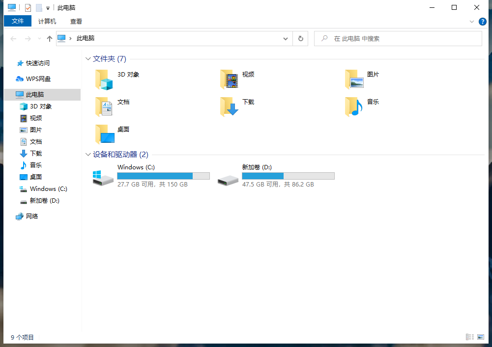

# jq-simple-doc

A simple document by jquery

## NOTE: just support 2-level nested

## Useage:

Just need edit ./js/docs.js.
Edit json inside like this:

```js
const DOCS = [
    {
        title: "Parent title",
        children: [
            {
                title: "Children title",
                content: `
                <h2>Subtitle</h2>
                <p>Some words</p>
                
                `,
            },
        ],
    },
    {
        title: "Single title",
        content: ``,
    },
];
```

And picture use relative path in ./imgs
